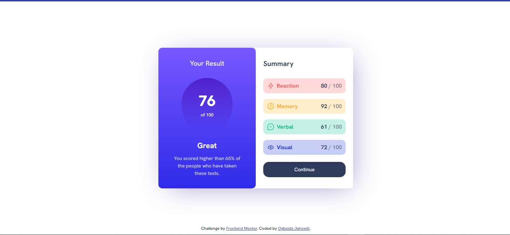

# Frontend Mentor - Results summary component solution

This is a solution to the [Results summary component challenge on Frontend Mentor](https://www.frontendmentor.io/challenges/results-summary-component-CE_K6s0maV). Frontend Mentor challenges help you improve your coding skills by building realistic projects. 

## Table of contents

- [Overview](#overview)
  - [The challenge](#the-challenge)
  - [Screenshot](#screenshot)
  - [Links](#links)
- [My process](#my-process)
  - [Built with](#built-with)
  - [What I learned](#what-i-learned)
  - [Useful resources](#useful-resources)
- [Author](#author)

## Overview

### The challenge

Users should be able to:

- View the optimal layout for the interface depending on their device's screen size
- See hover and focus states for all interactive elements on the page

### Screenshot

### Links

- Solution URL: [frontend-bootcamp-result-summary-card](https://frontend-bootcamp-result-summary-card.netlify.app/)
- Live Site URL: [frontend-bootcamp-result-summary-card](https://frontend-bootcamp-result-summary-card.netlify.app/)

## My process

### Built with

- Semantic HTML5 markup
- CSS custom properties
- Sass

### What I learned

I learnt about a practical way of organizing my sass files.

### Useful resources

- [Practical way to organize your Sass files](https://medium.com/@brunofrontend/practical-way-to-organize-your-sass-files-98c27a2623a2) - This helped me with organizing my sass files.

## Author

- GitHub - [Ogbeide Jahswill](https://github.com/JhayJahswiil)
- Frontend Mentor - [@JhayJahswiil](https://www.frontendmentor.io/profile/JhayJahswiil)
- Twitter - [@JhayJahswill](https://www.twitter.com/JhayJahswill)

